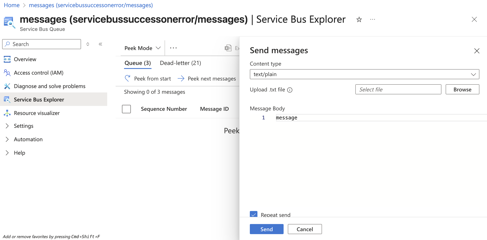

# Test Repository & Examples

This repository is a sandbox for testing Azure Functions with Service Bus SDK binding (batch processing and manual completion) using the preview extension: [azure-functions-nodejs-extensions-servicebus](https://github.com/Azure/azure-functions-nodejs-extensions/tree/bfdb548a7316783b8214d4ade9f1828dfafa04f8/azure-functions-nodejs-extensions-servicebus).

It hosts two minimal examples to compare build/package workflows and runtime behavior:
- `npm/` — TypeScript compiled with `tsc`, run locally via Functions Core Tools.
- `pnpm-esbuild/` — TypeScript bundled with `esbuild`, optimized output in `dist/`.

See Service Bus binding configuration options in the official docs: [Service Bus trigger and bindings](https://learn.microsoft.com/en-us/azure/azure-functions/functions-bindings-service-bus?tabs=isolated-process%2Cextensionv5&pivots=programming-language-javascript).

## Getting Started

- npm example:
  - `cd npm`
  - `npm ci && npm run build && npm run start`
  - For deployment and environment capture: `./run.sh`

- pnpm + esbuild example:
  - `cd pnpm-esbuild`
  - `pnpm install && pnpm start` (builds then starts)
  - For deployment and environment capture: `./run.sh`

## How to send messages

You can send message using Azure portal using `Service Bus Explorer`.

