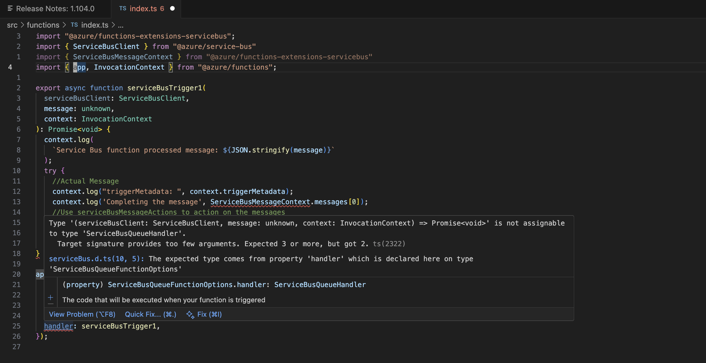
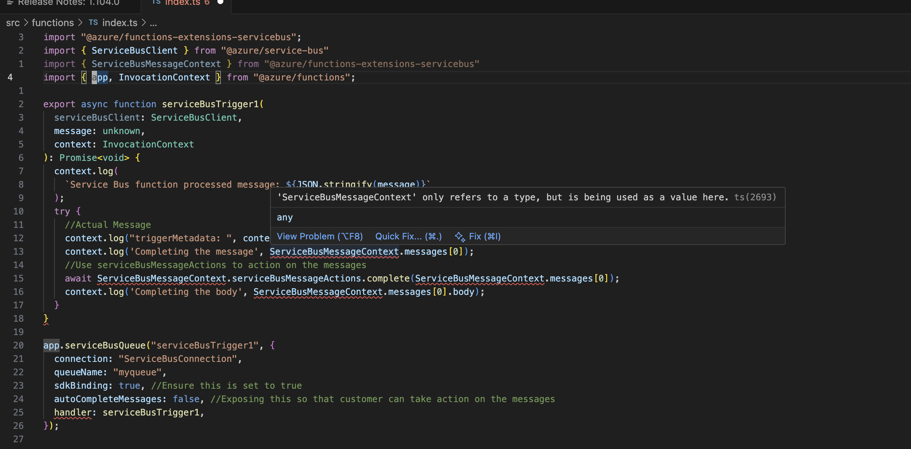
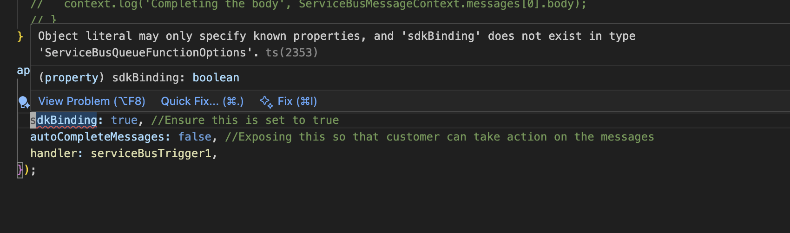
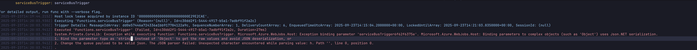
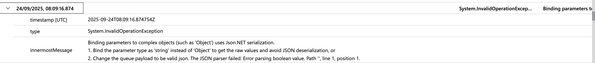

# Errors (npm variant)

This page documents the current issues found while using the npm-based example with the preview Service Bus SDK binding. Each section summaries symptoms, root cause, and a practical workaround, with screenshots for reference.

## 1) Missing type declarations (minimist)

- Symptom: `TS7016` complaining about missing types for `minimist` (used by the extension) during `tsc`.
- Root cause: the extension imports `minimist` without bundling its types.

## 2) Handler signature mismatch

- Symptom: Type error that the handler provides too few/mismatched arguments; see screenshot.



## 3) `ServiceBusMessageContext` is type-only

- Symptom: `TS2693: 'ServiceBusMessageContext' only refers to a type, but is being used as a value` when trying to call `ServiceBusMessageContext.serviceBusMessageActions.complete(...)`.
- Root cause: the library publishes the interface but no runtime value.



## 4) `sdkBinding` is not in the public types

- Symptom: `TS2353` on `sdkBinding` property inside `app.serviceBusQueue` options; see `./assets/sdk-binding.png`.
- Root cause: the option is required at runtime by the preview, but missing from `ServiceBusQueueFunctionOptions` type.



## 5) Runtime binding/JSON errors

- Symptom: Function fails with `Binding parameters to complex objects ... uses Json.NET serialization` both locally and in Azure see [logs](./assets/logs.csv).

### Local 

- Screenshots: local (``) and Azure (``). Raw export: `./assets/logs.csv`.



### Azure 



## Reproduce
1) `cd npm && npm ci && npm run build`.
2) Remove `@types/minimist` to reproduce the type error, then rebuild.
3) Send a non-JSON message via Service Bus Explorer to reproduce the JSON.NET error.

## Querying logs (Azure)
Use the following KQL in Application Insights to inspect traces/exceptions:

```kql
traces
| union exceptions
| where timestamp > todatetime('2025-09-23 14:28:11')
| project timestamp, message, type, innermostMessage
| order by timestamp
```
